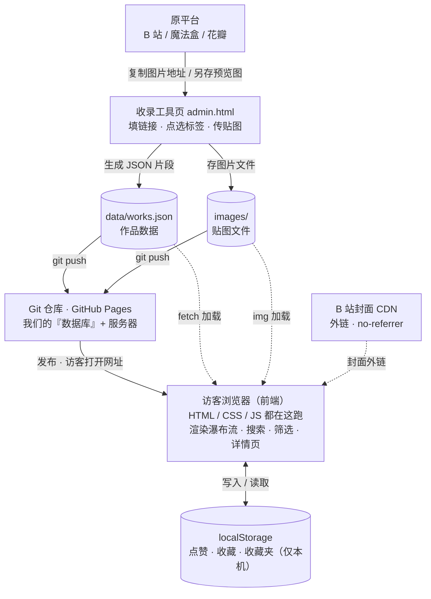

# TECH_DESIGN — VFXEffectHub 技术设计

> Day 5（2026-09-20）产出，以 `docs/prd.md`（Day 4 终版）为输入。
> 本文档只定「用什么做、数据怎么流」，不含具体代码；Day 7 起开发以本文档为准。

---

## 1. 架构总览

**纯前端静态网站：无后端、无数据库、零依赖。**

- **前端**：浏览器里跑的 HTML/CSS/JS，负责全部界面与交互
- **作品数据**：Git 仓库里的 JSON 文件（`data/works.json`）
- **贴图文件**：直接存仓库 `images/` 目录
- **用户私有数据**：浏览器 localStorage（点赞/收藏状态、收藏夹）——每位访客一份，存在各自电脑上
- **托管**：GitHub Pages（静态文件服务器，push 即发布）

**为什么可以没有后端**：判断标准是「数据是否需要多人共享写入」。我们全部功能都不需要——作品数据的「共享」由 Git 仓库承担（编辑者改文件 push，所有访客可见）；需要后端的三个功能（登录、全站统计、云端同步）已在 PRD 中砍掉/推迟，架构与需求在此咬合。

---

## 2. 技术路线（Day 5 拍板）

> **技术路线：纯 HTML/CSS/JS + JSON 数据文件 + 浏览器 localStorage + GitHub Pages 托管（无后端、无数据库、零依赖）**

| 决策点 | 选择 | 理由 | 落选方案为什么不选 |
|---|---|---|---|
| 开发方式 | **纯 HTML/CSS/JS** | 零基础学习价值最大，学到的东西最「网页本质」；PRD 的 7 个功能没有一个需要框架；无工具链负担，文件即网站 | Vue 3（CDN）：要多学一层框架概念；Astro：需 Node 构建链与构建流程，21 天周期内性价比低 |
| 数据格式 | **JSON 文件**（一条作品一个对象，集中一个 `works.json`） | JSON 是通用数据格式，学一次到处能用；localStorage 里存的也是 JSON 字符串，概念复用 | 一作品一文件：30 条作品 30 个文件，收录与维护都碎 |
| 部署 | **GitHub Pages** | 免费、不注册新账号、与现有 Git 仓库无缝——push 即上线；静态站天生适配 | Cloudflare Pages：国内可达性更好，但多注册一个账号、流程多一步，MVP 阶段不值；日后有需要可迁 |
| 收录操作 | **收录工具页**（仅本地使用的表单页） | 满足 PRD F6「收录界面提供预设标签快速选择」验收；上线前预收录 30 条不痛苦 | 直接手改 JSON：开发期快但没有界面，PRD 那条验收过不了 |

---

## 3. 页面与目录结构（规划，Day 7 起搭建）

```
VFXEffectHub/
├─ index.html        # 入口页：Unity / UE / 贴图 三分区导航
├─ unity.html        # Unity 分区（瀑布流 + 搜索 + 二次筛选）
├─ ue.html           # UE 分区（同上）
├─ texture.html      # 贴图分区（同上）
├─ detail.html       # 详情页（?work=作品id，JS 动态读取渲染）
├─ admin.html        # 收录工具页（仅本地使用，站内不设入口）
├─ css/
│  └─ style.css      # 全站样式
├─ js/
│  ├─ common.js      # 公共：数据加载、分区切换、搜索/筛选逻辑
│  ├─ detail.js      # 详情页逻辑
│  └─ admin.js       # 收录工具页逻辑（生成 JSON 片段）
├─ data/
│  └─ works.json     # 全部作品数据
└─ images/           # 贴图文件（收录时上传）
```

说明：三个分区页结构相同，仅数据源不同（按 `sourceType` 过滤同一份 `works.json`），大量逻辑可复用 `common.js`。

---

## 4. 作品数据结构（works.json 字段设计）

| 字段 | 类型 | 必填 | 说明 |
|---|---|---|---|
| `id` | 字符串 | 是 | 唯一标识，收录工具页自动生成（如 `w20260920-001`） |
| `sourceType` | 字符串 | 是 | `unity` / `ue` / `texture` 三选一，决定所属分区 |
| `title` | 字符串 | 是 | 作品标题（瀑布流卡片显示） |
| `sourceUrl` | 字符串 | 是 | 来源链接（B 站 / 魔法盒 / 花瓣原网址） |
| `author` | 字符串 | 是 | 作者名 |
| `coverUrl` | 字符串 | 视频类可选 | 封面图外链（右键「复制图片地址」） |
| `imageFile` | 字符串 | 贴图类必填 | 本仓库图片路径（如 `images/w20260920-001.webp`） |
| `tags` | 字符串数组 | 否 | 预设或自定义标签（预设起点列表见 PRD F6） |
| `createdAt` | 字符串 | 是 | 收录日期 |

localStorage 键名约定（Day 7 实现时遵循）：

- `vfx-likes`：已点赞的作品 id 数组
- `vfx-favs`：已收藏（红心状态）的作品 id 数组
- `vfx-collections`：收藏夹列表（名字 + 作品 id 数组）

---

## 5. 数据接口清单（本站的「API」）

本站无后端，因此没有传统意义的 API；本节把**全部数据出入口**列成清单，Day 7 实现时以此为完整范围——清单之外不再有别的数据来源。

**读数据（页面 → 数据）**

| 接口 | 方式 | 谁在用 | 说明 |
|---|---|---|---|
| `data/works.json` | `fetch`（GET） | 三个分区页、detail.html | 拉取全部作品后，在浏览器内按 `sourceType` 过滤 / 搜索 / 二次筛选 |
| `images/*` 本仓库贴图 | `` | 各分区页、detail.html | 收录时上传的贴图文件 |
| B 站封面 CDN | ``（no-referrer） | 各分区页、detail.html | 视频类作品封面外链 |
| `vfx-likes` / `vfx-favs` / `vfx-collections` | `localStorage.getItem` | 各页面 | 读本机的点赞 / 收藏 / 收藏夹状态 |

**写数据**

| 接口 | 方式 | 谁在用 | 说明 |
|---|---|---|---|
| 同上三个键 | `localStorage.setItem` | 点赞 / 收藏 / 收藏夹操作 | 只写本机，不影响他人 |
| 生成 JSON 片段 | 收录工具页（admin.html） | 仅编辑者本地使用 | **不直接写文件**——生成文本让你复制进 `works.json`，git push 生效 |

**边界**：访客侧所有操作都是「读仓库文件 + 读写自己 localStorage」，没有任何写入仓库的通道——这与 PRD「收录入口不对公众开放」天然一致。

---

## 6. 错误处理（Day 7 实现时遵循）

原则：**任何一处出错都不白屏、不报错弹窗**，页面始终给出人话提示。

| 出错场景 | 处理方式 |
|---|---|
| `works.json` fetch 失败（断网 / 文件缺失） | 页面主体显示「内容加载失败，请刷新重试」提示区 |
| JSON 解析失败（文件格式写坏） | 同上提示 + `console.error` 打印错误位置，方便排错 |
| 单条作品字段缺失 | 渲染时逐字段兜底：`coverUrl` 空 → 占位图；`tags` 空 → 空数组；单条坏数据不拖垮整页 |
| 图片加载失败（B 站封面链接失效等） | `` 的 `onerror` → 换占位图 |
| detail.html 的 `?work=` 传入无效 id | 显示「作品不存在」+ 返回分区链接 |
| localStorage 不可用（隐私模式 / 被禁用） | 浏览功能不受影响；点赞收藏操作时提示「浏览器存储不可用」 |
| 搜索 / 筛选无结果 | 显示「没有找到相关结果」（PRD F3 已定） |

---

## 7. 环境变量

**无。** 理由：纯静态站零依赖、无密钥、无第三方服务，数据即文件随仓库走，不存在需要按环境切换的配置。

将来若迁移 Cloudflare Pages 或加后端，届时才引入环境变量，且密钥只放平台的环境变量设置里、**绝不写进仓库**——与 `.gitignore` 中排除 `.env` 的既有规则呼应。

---

## 8. 图片显示策略（防盗链应对，Day 4 实测结论落地）

- **视频封面（B 站图源）**：外链直接嵌入 + 全站每个页面加 `<meta name="referrer" content="no-referrer">`（无来源请求实测可过 B 站防盗链，200）
- **贴图（花瓣等图源）**：一律不上外链（地址带当天过期的签名，必裂图），收录时右键另存免费预览版 → 存入本仓库 `images/` → 网站从自己仓库加载，最稳

---

## 9. 本地开发与部署

- **本地开发**：`python -m http.server 8000` 后访问 `http://localhost:8000`（用 fetch 读 JSON 必须经 http 协议，不能直接双击 file:// 打开——这是浏览器安全限制，也顺带理解了「服务器」的一个真实作用）
- **部署**：GitHub 仓库 Settings → Pages → Deploy from branch → `main` 分支 / 根目录（`/`），保存后 `https://xingho-vibecoding.github.io/VFXEffectHub/` 即为线上地址

---

## 10. 数据流图

**收录流（编辑者操作，数据进仓库）**：原平台内容 → 收录工具页（复制图片地址 / 另存预览图、填表单、点选标签）→ `data/works.json` + `images/` → git push → GitHub 仓库。

**浏览流（访客侧，数据到眼前）**：GitHub Pages 发布静态站 → 访客浏览器加载 HTML/CSS/JS → fetch 拉取 `works.json`、img 加载本仓库贴图与 B 站封面（no-referrer）→ 渲染瀑布流 / 搜索 / 二次筛选 / 详情页 → 点赞、收藏、收藏夹读写 localStorage（仅本机）。



> **一句话（今日学习目标答案）**：作品数据从原平台经你手动收录进 Git 仓库，经 GitHub Pages 到每个访客的浏览器里变成页面；点赞收藏数据从访客手里来、到他自己电脑的 localStorage 里去——**全程无后端**。

---

## 11. 风险与已知限制

1. **GitHub Pages 国内访问速度不稳定**：MVP 验证阶段可接受；日后如成问题，静态站整体可平移到 Cloudflare Pages，改动成本低
2. **localStorage 换设备 / 清缓存即丢**：PRD 已明确声明（收藏夹、点赞状态）；升级路径见 PRD 第 6 节
3. **数据全量加载**：30 条规模无压力；未来数百条再按分区拆分 JSON 文件，属优化不属于重构
4. **数据一致性靠人**：`id` 唯一性、贴图文件与 JSON 记录对应关系，由收录工具页生成时保证；手动改文件时需自查

---

## 12. 升级路径（与 PRD 第 6 节呼应）

未来若做「登录 + 云端同步」：加后端与数据库，localStorage 数据迁移至账号下；届时本架构的静态部分（页面、作品数据文件）可整体保留，只增不拆。
